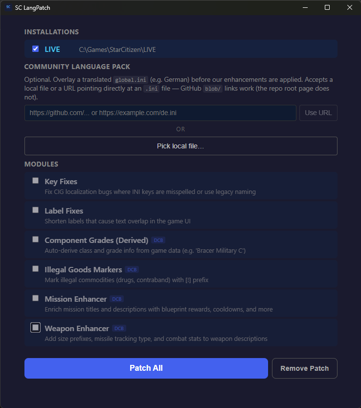
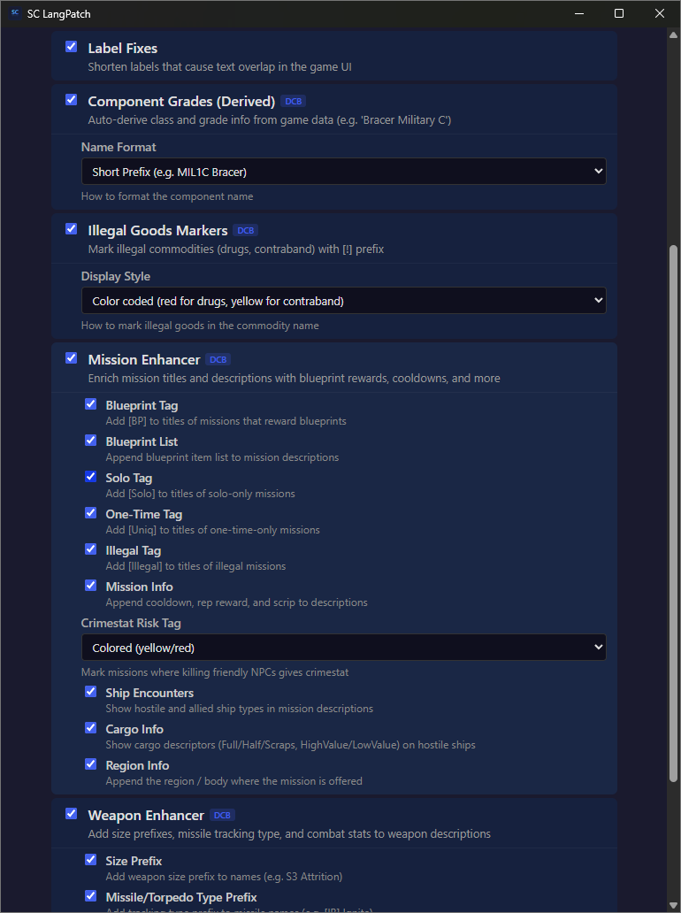
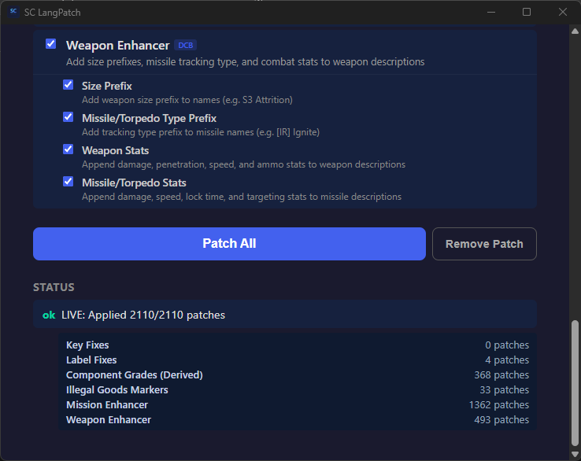
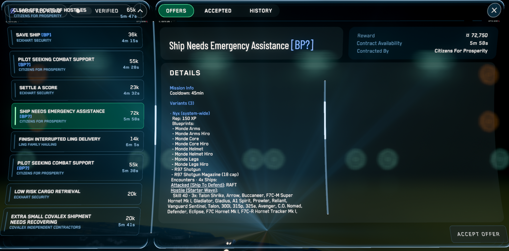
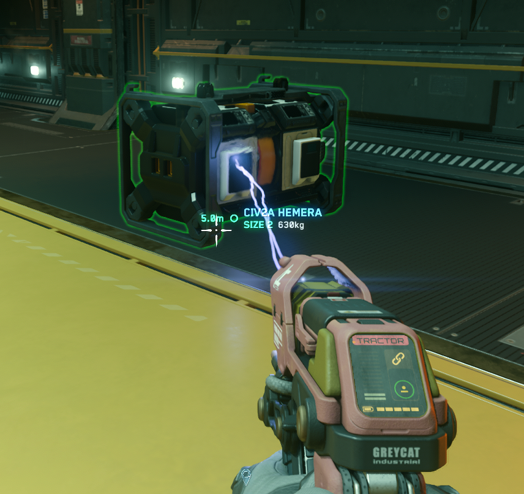

# SC LangPatch

A language-pack *patcher* for Star Citizen.

🇩🇪 [Deutsche Anleitung](README.de.md)

[](https://github.com/VeeLume/sc-langpatch/releases/latest)
[](https://github.com/VeeLume/sc-langpatch/releases)
[](LICENSE)

Most Star Citizen language packs are a `global.ini` file you copy in by hand. **SC LangPatch is the patcher itself** — a small Windows app that reads the data straight out of *your* `Data.p4k` and writes a fresh, version-matched `global.ini` for every install (LIVE / PTU / EPTU / TECH-PREVIEW). No copy-paste, no chasing the right file after every update, no waiting on a maintainer to re-roll the pack — every patch is generated from your current game data. Each enrichment is its own toggle.

**Already using a community language pack?** Drop in a file path or URL and SC LangPatch will overlay its enrichments on top of it — your translation stays, the extra labels get added. See [Community language packs](#community-language-packs) below.

The app UI itself is available in **English** and **Deutsch** — auto-detected from your OS locale, switchable via the gear icon in the top right. Want to add another language? See [TRANSLATING.md](TRANSLATING.md).



> [!NOTE]
> Inspired by the Language Pack idea from [ExoAE](https://github.com/ExoAE/ScCompLangPack) and [BeltaKoda's Remix](https://github.com/BeltaKoda/ScCompLangPackRemix). If you'd rather not run a patcher, those static packs (and [MrKraken's StarStrings](https://github.com/MrKraken/StarStrings)) are excellent and well-curated. SC LangPatch's niche is doing the same kind of work *automatically*, against whatever build you have installed right now.

## Includes

- **Component class + grade prefixes** so you can size up loot at a glance
  - `Bracer` → `MIL1C Bracer`  *(Military, size 1, grade C)*
  - `XL-1` → `MIL2A XL-1`
- **Illegal goods markers** based on jurisdiction law data, not a hand-maintained list
  - `Altruciatoxin` → `[!] Altruciatoxin`
- **Mission Enhancer** — rewrites mission descriptions to surface what the briefing currently hides
  - blueprint rewards (with the actual item names), reputation gains, cooldowns, ship encounters
  - title tags: `[Solo]`, `[Uniq]`, `[BP]` / `[BP*]` / `[BP?]`, `[Illegal]`, `[CS Risk]`
- **Weapon Enhancer** — size prefixes, missile tracking type, and combat stats on weapon descriptions
  - `Dominator II Missile` → `[EM] Dominator II Missile`
- **Label & key fixes** — shortens commodity / HUD names that overflow their UI box, repairs misspelled localization keys
  - `Hephaestanite (Raw)` → `Heph (Raw)`
  - `Instability:` → `Instab.:`

> [!TIP]
> Don't like one of the changes? Toggle the module off and re-patch. Don't want any of it? **Remove Patch** restores vanilla in one click — no game files were ever modified.

> [!WARNING]
> **Re-run after every Star Citizen update.** Patches are derived from the build that's currently installed. If you skip a re-patch, the labels may reference keys that have moved.

---

## Quick start

1. **Download the installer** from the [latest release](https://github.com/VeeLume/sc-langpatch/releases/latest) — pick `SC.LangPatch_X.Y.Z_x64-setup.exe`.
2. **Run it.** Windows SmartScreen may warn you because the build isn't code-signed — click *More info* → *Run anyway*. The app installs to the usual Programs folder and adds a Start menu entry.
3. **Open SC LangPatch.** It auto-detects every Star Citizen install on your machine (LIVE, PTU, EPTU, TECH-PREVIEW) by reading the RSI Launcher's log. Tick the channels you want to patch.
4. **Hit "Patch"**. Done. Launch Star Citizen and the new labels are there.

To undo at any time, click **Remove Patch** — the generated file is deleted and Star Citizen falls back to its built-in English strings.

---

## Community language packs

Already using a translation pack or someone else's `global.ini` and want SC LangPatch's enrichments stacked on top? Paste the file path or URL into the **Language Pack** field and the patcher will overlay it onto the base English INI before applying patches. GitHub `blob/` URLs are auto-rewritten to `raw.githubusercontent.com`.

This is the recommended way to use SC LangPatch alongside translations like the [German pack](https://github.com/rjcncpt/StarCitizen-Deutsch-INI) — point at theirs, keep your own toggles, get both.

---

## Screenshots

### The app



*Pick which enrichments you want. Each module is independent — turn on what's useful, leave the rest off.*



*After patching, the results panel shows how many keys each module changed and flags anything that didn't resolve cleanly.*

### In-game



*Mission Enhancer in the contract terminal. The `[BP?]` title tag, the **Variants** section, the **Blueprints** list (Monde Arms, Monde Core, Monde Helmet, etc.), and the **Encounters** breakdown are all generated from the DataCore — none of that information is shown by the vanilla briefing.*



*Component grade prefix in the inspect view — the class/size/grade label is added in front of the component name so you can size up loot at a glance.*

---

## FAQ

**Is this against Star Citizen's TOS?**
SC LangPatch only writes to `global.ini`, the same file CIG ships in plaintext for translators to edit. It doesn't touch executables, hook the game process, or modify `Data.p4k`. That said, no mod is officially supported — use at your own risk.

**Does it break after every patch?**
The patches are derived live from your current `Data.p4k`, so they re-target whatever the new build ships. Just re-run the patcher after each Star Citizen update.

**Can I undo it?**
Yes. The app's **Remove Patch** button deletes the generated file. Star Citizen falls back to its built-in English text, exactly as if you'd never patched.

**Why is Windows SmartScreen warning me?**
The installer isn't signed with a paid code-signing certificate. The build itself comes straight from the [public source code](https://github.com/VeeLume/sc-langpatch) and CI builds; you can verify the signature against `latest.json` if you're paranoid.

**It says no installations were found.**
The app discovers installs by parsing the `Launching {Version}` line out of the RSI Launcher's log. Each channel (LIVE, PTU, EPTU, TECH-PREVIEW) only shows up after you've actually launched the game from that channel at least once — opening the launcher isn't enough. Launch each channel you want patched once, then re-open SC LangPatch.

---

## A note on AI assistance

Parts of this codebase — and this README — were written with the help of AI tools (primarily Claude Code). Every change is reviewed before it lands, and the project has tests covering the patching pipeline, but I want to be upfront about it rather than pretend otherwise. If you spot something that reads or behaves oddly, an issue or PR is very welcome.

---

## For developers

The rest of this README covers building from source. End users don't need any of it — grab the installer above.

### Stack

- **Frontend:** [Svelte 5](https://svelte.dev/) + [Tauri 2](https://tauri.app/)
- **Backend:** Rust 2024 edition
- **Game-data extraction:** [svarog](https://github.com/19h/Svarog) (P4K + DataCore parsing)

### Prerequisites

- [Node.js](https://nodejs.org/) LTS
- [pnpm](https://pnpm.io/)
- [Rust](https://rustup.rs/) stable, 2024 edition

### Build & run

```bash
pnpm install
pnpm tauri dev      # hot-reload dev build
pnpm tauri build    # release installer
```

### Test

```bash
cd src-tauri
cargo test
```

### Architecture

```
Data.p4k (user's SC install)
  ├── global.ini  (UTF-16 LE)  → decode → HashMap<key, value>
  └── Game2.dcb   (DataCore)   → svarog-datacore → DataCoreDatabase
         ↓
  Phase 1: Key Renames (priority-0 modules first)
  Phase 2: Value Patches (all other modules)
         ↓
  Patched global.ini (UTF-8 with BOM) → written to SC install
```

Modules implement the `Module` trait and produce `(key, PatchOp)` pairs. Two flavours:

- **Code modules** query the DataCore at runtime to derive patches dynamically (Component Grades, Illegal Goods, Mission Enhancer, Weapon Enhancer).
- **TOML modules** declare static patches in embedded TOML files, with key patterns and template captures for the bulk fixes (Key Fixes, Label Fixes).

For everything else — DCB exploration tips, the data flow per module, how to write a new module — see [CLAUDE.md](CLAUDE.md).

### Headless preview tools

Two debugging binaries live in `src-tauri/src/bin/`:

```bash
cd src-tauri
cargo run --bin preview_cli                      # text dump
cargo run --bin preview_tui --features preview_tui  # interactive browser
```

Both load datacore + INI once and let you iterate on rendering without restarting the game.

---

## License

[MIT](LICENSE)
